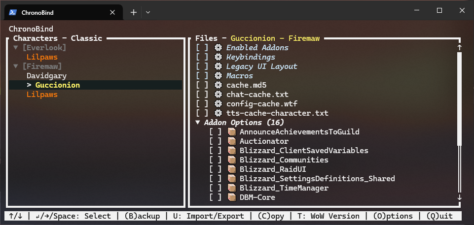
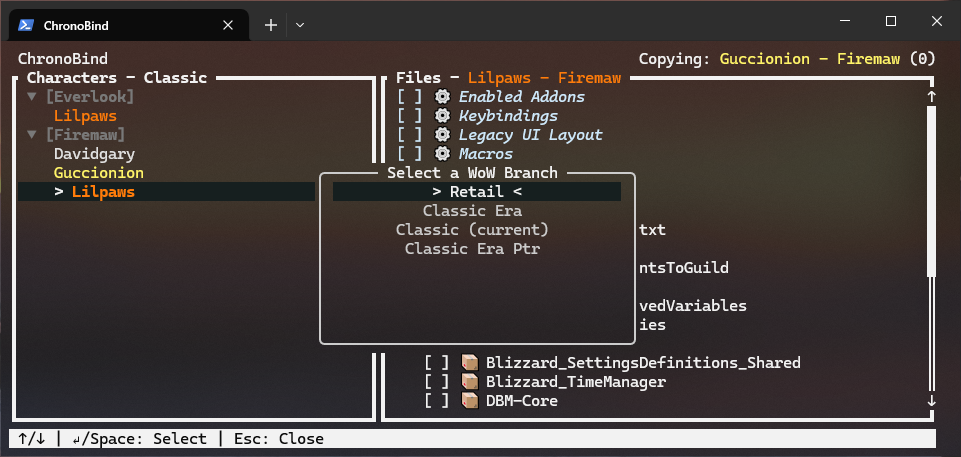
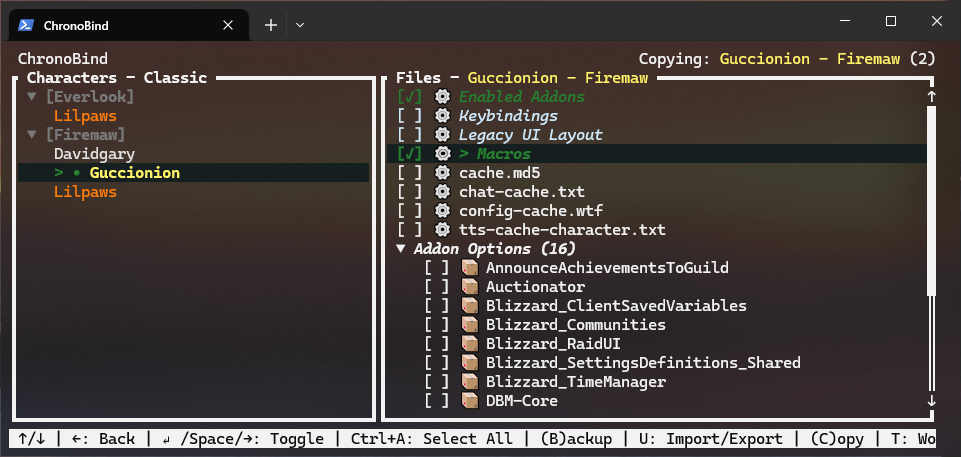
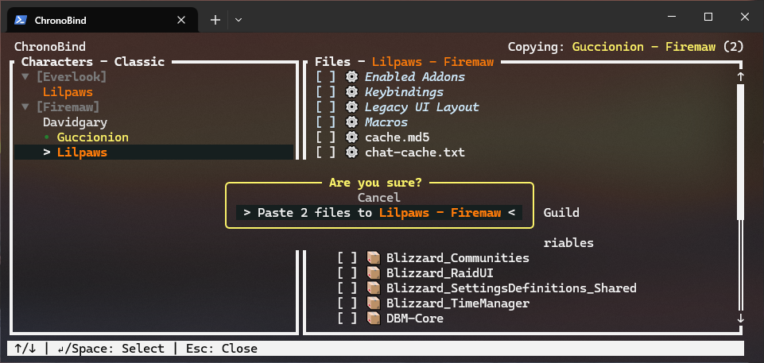
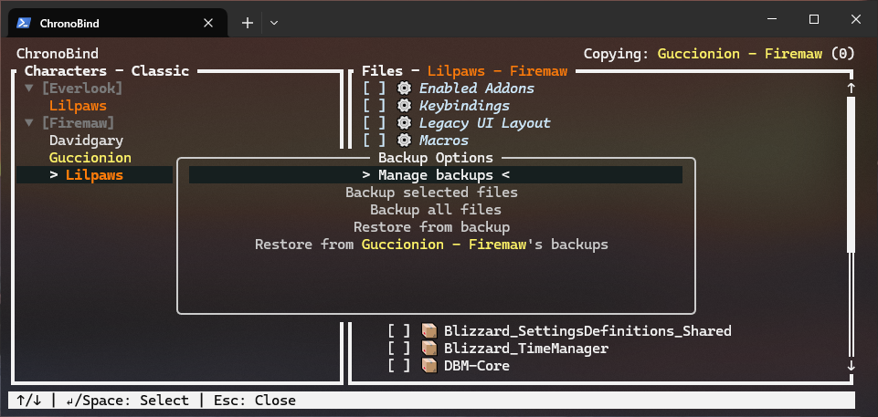
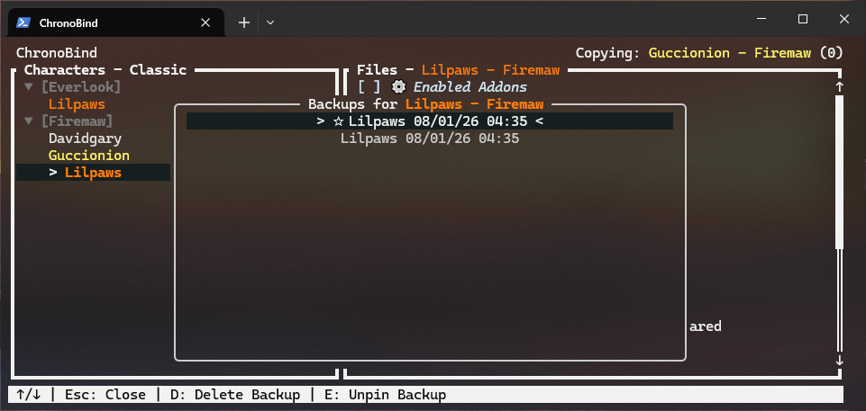
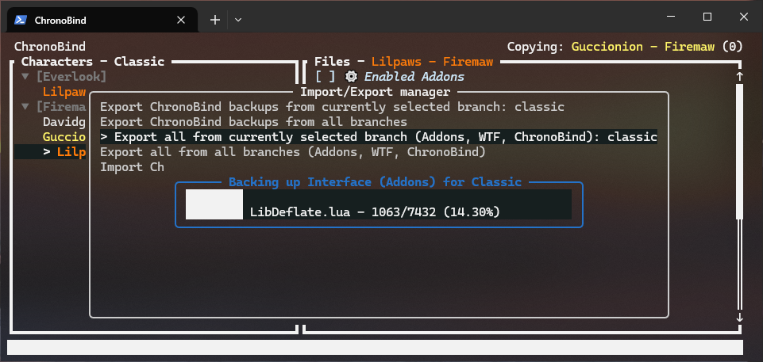

# ChronoBind

[](LICENSE)
[](https://www.rust-lang.org)

ChronoBind is a terminal-based UI tool for managing World of Warcraft character data.

It allows you to easily copy character configurations to and from characters, as well as providing an easy-to-use
backup creation and restoration utility for both individual characters, as well as entire World of Warcraft installations,
including installed AddOns, ChronoBind backups themselves and the user preferences/characters in the 'WTF' directory.

WoW install configurations can be exported from ChronoBind and then used to easily restore the same preferences on another computer.

## Features

- Automatically detects World of Warcraft installations
- Clean, terminal-based user interface built with Ratatui, popup driven.
- Pasting of configuration files between characters, automatically creating a backup of the replaced files incase you need to
revert the change.
- Automatically cleans the oldest unpinned, automatically created backups once reaching a configurable amount, so as to not 
take up too much space on your drive.
- Restore and export/import flows (branch-level exports supported) with progress bars and cancellable task chains.
- A companion World of Warcraft addon that provides additional information to ChronoBind, enabling class colouring, etc.

## Requirements

- World of Warcraft installed, the app will automatically read from your `Battle.net` install to find your installed World of Warcraft editions.

## UI Overview

### Main Character View



The main interface shows your characters with class-colored names, grouped by realm with the ability to collapse realms you do not wish to view. Navigate with arrow keys or WASD, and use the action keys shown in the bottom bar to copy, paste, backup, or restore character data.

### Branch Selection



Switch between WoW editions (Retail, Classic, etc.) to manage characters across different game versions. Each World of Warcraft version will be automatically detected when you launch the application.

### File Selection


Selected specific configuration files to copy or backup. Friendly names are shown in place of their real file names for common files like keybindings, macros, and UI layouts.

### Paste Dialog



When pasting configurations from another character, ChronoBind automatically creates a backup of the files being replaced so you can easily revert if needed.

### Backup Options



Create manual backups with options to pin them (preventing auto-cleanup) or back up only selected files instead of all character data.

### Backup Management



View and manage all backups for a character. Restore from any backup, pin important ones, or delete old backups you no longer need.

### Import Dialog


Import previously exported character or branch configurations. Useful for setting up WoW on a new computer or sharing configurations.

### Progress Tracking



All file operations show detailed the progress and completion percentage, and display what operations are taking place.

## Build and Run

### Requirements

- Rust toolchain with 2024 edition support (install via <https://rustup.rs/>).

### Run

```sh
cargo run --release
```

## Usage

### Basic Usage

1) Launch ChronoBind, the app auto-detects WoW installs and selects your preferred branch if configured.
2) Navigate the character list, refer to the controls listed on the bottom bar for navigation.

### Additional information

- Backups are stored under the ChronoBind directory inside each branch (`_branch_/ChronoBind/Characters/<Account>/<Realm>/<Name>`).
- Backups are simple ZIP files that can be accessed with any program that supports opening ZIPs should you need to manually access any files backed up by ChronoBind.

## Companion Addon

- Install the ChronoBind Companion addon to export a small amount of additional data into the `SavedVariables` folder of each character, that provides ChronoBind with your characters: `class`, `level` and `guid`
- This enables ChronoBind to display your characters in an easier-to-interpret way.

## Status

Early-stage (0.1.0). Please report issues, suggest ideas and consider contributing to the project to add new features.

## License

This project is licensed under the MIT License - see the [LICENSE](LICENSE) file for details.